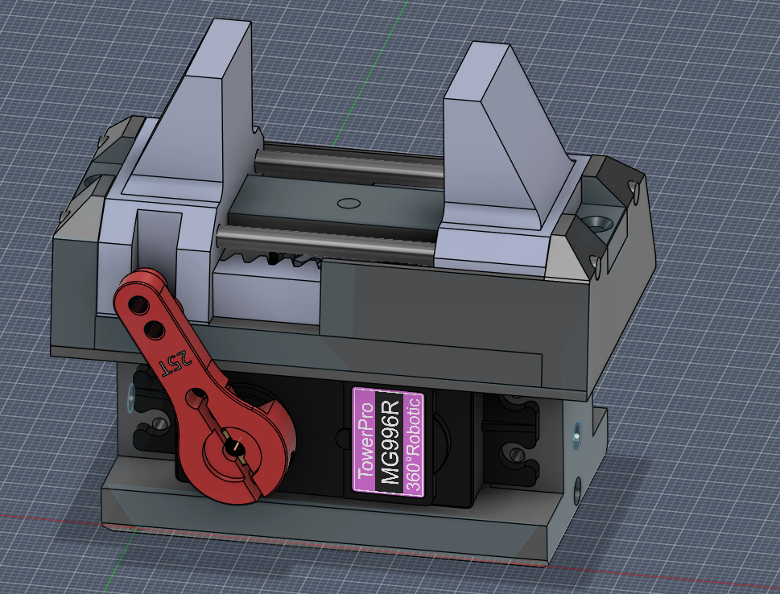

# servogripper

Compact MG996R servo gripper.

This design is heavily inspired by the AR4 Servo Gripper by Annin Robotics:  
https://anninrobotics.com/wp-content/uploads/2025/07/AR4-Servo-Gripper-Manual.pdf

The original design was a bit overkill for my use case, mainly because it was intended for a 25 kg servo.
This version was adapted to use an MG996R instead, along with a few smaller design changes to better fit a more compact setup.

At the moment, there is no finalized mounting solution for rotation included. The bottom part has two holes on each side for heat-set inserts.  
However, the bottom part can be modified easily to add whatever mounting pattern or bracket is needed for your application.

## Required hardware / tools

- 1x MG996R servo
- 1x M3x5 mm socket head screw for the servo horn  
  Longer screws can also be used, but they will stick out and may need to be cut or sawed shorter.
- 1x 25T servo horn
- 6x M3x10 mm countersunk screws  
  Used to connect the top part to the bottom part, and the rail to the top part.
- 2x 3 mm x 72 mm steel rods  
  Used for the top part with the jaws.
- 1x 3 mm x 15 mm steel rod  
  Used for the gear connection. Since this size may be hard to find, it is easiest to buy a 3 mm x 200 mm rod and cut it to length.
- Super glue  
  Used to secure the rods in the top part.
- 3 mm drill bit  
  For re-drilling / cleaning up the holes if needed.
- Sandpaper  
  Recommended for smoothing the underside of the jaws after printing, since the supported surfaces may come out uneven.

## Notes

- The screws are not included in the CAD model because I was too lazy to add them.
- For detailed instructions, please see the linked AR4 Servo Gripper manual.
- Do not tighten the rail screws too much, otherwise the gear may not rotate freely.
